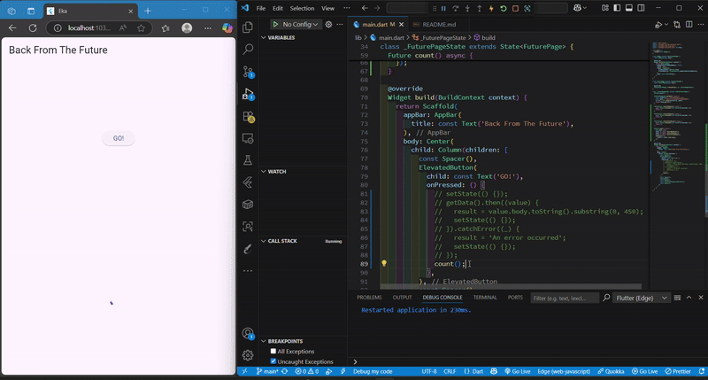
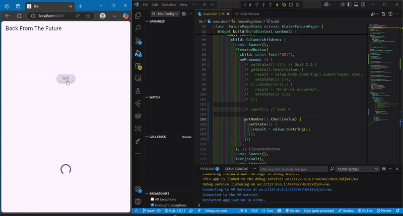
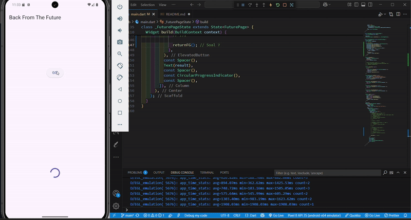
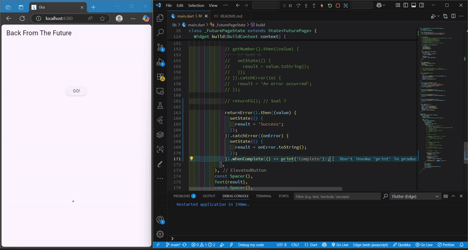
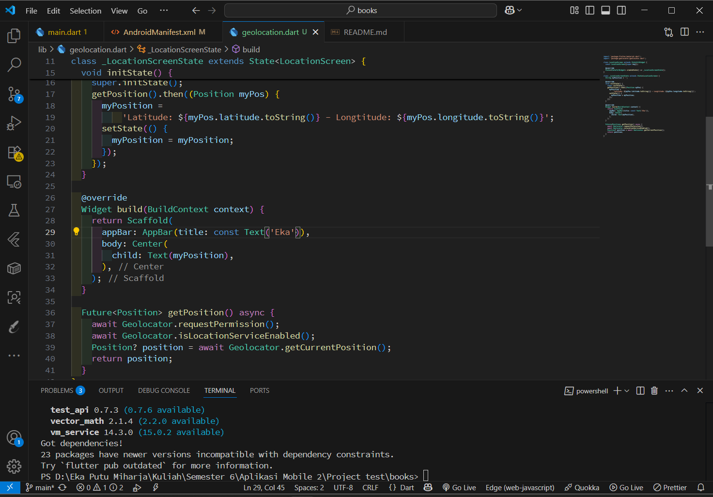
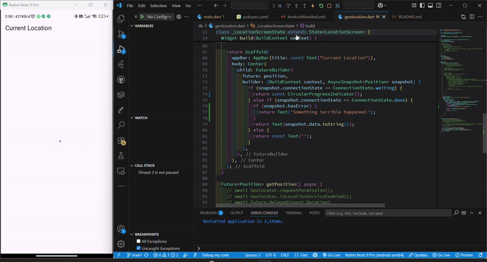

# Praktikum : Asynchronous

Projek Buku

## Praktikum 1

### Soal 2


### Soal 3


- **_substring(0, 450)_** digunakan untuk mengambil 450 karakter pertama dari isi respons server agar tampilannya tidak terlalu panjang.

- **_.catchError((\_) {...})_** digunakan untuk menangani error yang mungkin terjadi saat mengambil data, misalnya jaringan gagal atau server error, dan mencegah aplikasi crash.

## Praktikum 2

### Soal 4



- **Langkah 1 : Menambahkan 3 method async**

```dart
Future<int> returnOneAsync() async {
    await Future.delayed(const Duration(seconds: 3));
    return 1;
  }

  Future<int> returnTwoAsync() async {
    await Future.delayed(const Duration(seconds: 3));
    return 2;
  }

  Future<int> returnThreeAsync() async {
    await Future.delayed(const Duration(seconds: 3));
    return 3;
  }
```

**Maksud dari penambahan 3 method async pada code diatas :**

1. Ketiga method tersebut adalah fungsi _asynchronous_ yang menunggu ( _await_ ) selama 3 detik, lalu mengembalikan angka 1, 2, dan 3 dari urutan/kondisi methodnya.

2. _Future.delayed_ mensimulasikan proses yang memerlukan waktu, seperti memuat data dari internet atau database.

3. Masing-masing fungsi seperti representasi tugas asynchronous yang selesai dalam 3 detik.

- **Langkah 2 : Menambahkan method count()**

```dart
Future count() async {
    int total = 0;
    total = await returnOneAsync();
    total += await returnTwoAsync();
    total += await returnThreeAsync();
    setState(() {
      result = total.toString();
    });
  }
```

**Maksud dari penambahan penambahan method count() pada code diatas :**

1. Fungsi _count()_ menjalankan ketiga fungsi _async_ tadi secara berurutan.

2. Nilai yang dikembalikan oleh masing-masing fungsi dijumlahkan ke dalam variabel total.

   - Setelah 3 detik: total = 1

   - Setelah 6 detik: total = 1 + 2 = 3

   - Setelah 9 detik: total = 1 + 2 + 3 = 6

3. Setelah semuanya selesai, _setState()_ dipanggil untuk memperbarui tampilan aplikasi (UI) dengan nilai total tersebut.

## Praktikum 3

### Soal 5



- **Langkah 2 : Menambahkan Variabel dan Method**

```dart
late Completer completer;

Future getNumber() {
  completer = Completer<int>();
  calculate();
  return completer.future;
}

Future calculate() async {
  await Future.delayed(const Duration(seconds : 5));
  completer.complete(42);
}
```

**Maksud dari penambahan variabel dan method pada code diatas :**

1. Completer adalah objek khusus yang digunakan untuk mengontrol penyelesaian (complete) dari sebuah Future secara manual.

2. Kata kunci late berarti completer akan diinisialisasi nanti, sebelum digunakan — tepatnya di dalam getNumber().

3. Fungsi ini membuat Completer<int> baru.

4. Kemudian menjalankan method calculate() yang akan menyelesaikan (complete) Completer setelah 5 detik.

5. Mengembalikan Future dari completer.future, yang nantinya akan bernilai 42 ketika calculate() selesai.

6. Fungsinya seperti menunggu jawaban dari proses asinkronus yang kita kontrol sendiri.

7. Menunggu selama 5 detik (delay).

8. Setelah selesai, memanggil completer.complete(42); untuk menyelesaikan Future dari getNumber() dan memberikan nilainya 42.

### Soal 6

**Code Langkah ke 2**

```dart
Future calculate() async {
  await Future.delayed(const Duration(seconds : 5));
  completer.complete(42);
}
```

**Code Langkah ke 5-6**

```dart
Future calculate() async {
    try {
      await Future.delayed(const Duration(seconds: 5));
      completer.complete(42);
    } catch (_) {
      completer.completeError({});
    }
  }


  getNumber().then((value) {
                // Soal 6
                setState(() {
                  result = value.toString();
                });
              }).catchError((e) {
                result = 'An error occurred';
              });
```

**Maksud dari perbedaan langkah 2 dan lankah 5-6 code diatas :**

1. Penanganan Error

   - Langkah 2 tidak menggunakan try-catch. Jika terjadi kesalahan saat proses berlangsung ( contoh: completer.complete() dipanggil dua kali atau terjadi exception lain), maka program akan langsung error atau crash.

   - Langkah 5–6 menambahkan try-catch di dalam method calculate() dan catchError() saat memanggil getNumber(). Jadi saat penambagan try-catch, membuat program jadi lebih aman. Karena kalau terjadi kesalahan, error bisa ditangkap dan ditangani dengan baik.

2. Kode calculate()

   - Pada Langkah 2, isi dari method calculate() hanya menunggu selama 5 detik, kemudian langsung menyelesaikan future (completer.complete(42)) tanpa mempertimbangkan apakah ada error atau tidak.

   - Sedangkan pada Langkah 5, method calculate() mencoba menyelesaikan future dengan nilai 42 dalam blok try. Jika terjadi error, maka akan berpindah ke blok catch, dan future akan diselesaikan dengan status gagal (completer.completeError({})).

3. Tampilan di UI

   - Langkah 2 tidak memiliki mekanisme untuk menangani hasil error, sehingga jika terjadi kesalahan, pengguna tidak mendapatkan informasi apa pun (hanya kosong atau crash).

   - Langkah 5–6 memiliki penanganan pada sisi tampilan (.catchError((e) { ... })) yang memungkinkan aplikasi menampilkan pesan “An error occurred” saat terjadi kesalahan, sehingga pengguna tetap mendapat umpan balik yang jelas.

4. Keamanan Program

   - Program pada Langkah 2 lebih rentan crash karena tidak siap menangani kesalahan.

   - Sebaliknya, Langkah 5–6 jauh lebih aman dan stabil. Dengan adanya try-catch dan catchError(), aplikasi bisa menghindari crash dan tetap berjalan normal meskipun terjadi masalah.

## Praktikum 4

### Soal 7



### Soal 8

```dart
Langkah 1
void returnFG() {
    FutureGroup<int> futureGroup = FutureGroup<int>(); // Soal 7
    futureGroup.add(returnOneAsync());
    futureGroup.add(returnTwoAsync());
    futureGroup.add(returnThreeAsync());
    futureGroup.close();
    futureGroup.future.then((List<int> value) {
      int total = 0;
      for (var element in value) {
        total += element;
      }
      setState(() {
        result = total.toString();
      });
    });
  }

Langkah 4
void returnFG() {
    final future = Future.wait<int>([
      returnOneAsync(),
      returnTwoAsync(),
      returnThreeAsync(),
    ]);

    future.then((List<int> value) {
      int total = 0;
      for (var element in value) {
        total += element;
      }
      setState(() {
        result = total.toString();
      });
    });
  }
```

**Maksud dari perbedaan langkah 1 dan lankah 4 code diatas :**

1. **FutureGroup**

   - Bisa menambah Future secara bertahap/dinamis.

   - Penggunaan yang tepat untuk kondisi jumlah task tidak tetap (misalnya dalam perulangan atau kondisi tertentu).

   - Harus memanggil **_.close()_** setelah semua future ditambahkan.

   - Perlu tambahan import:

   ```dart
   import 'package:async/async.dart';
   ```

2. **Future.wait**

   - Praktis dan ringkas.

   - Tidak perlu memanggil close().

   - Semua future harus sudah diketahui saat dipanggil.

   - Tidak bisa menambah future setelah fungsi dijalankan.

## Praktikum 5

### Soal 9



### Soal 10

```dart
Langkah 1
Future returnError() async {
    await Future.delayed(const Duration(seconds: 2));
    throw Exception('Something terrible happend!');
  }

Langkah 4
Future handleError() async {
    try {
      await returnError();
    } catch (error) {
      setState(() {
        result = error.toString();
      });
    } finally {
      print("Complete");
    }
  }
```

Hasil setelah di run masih sama, tetapi terdapat perbedaan pada langkah 1 dan 4 code diatas

- Langkah 1 Method returnError()

  - Fungsi ini secara sengaja melempar error setelah menunggu 2 detik.

  - Jika kamu memanggil ini tanpa try-catch, maka program akan melempar unhandled exception, yang bisa menyebabkan aplikasi crash jika tidak ditangani.

- Langkah 1 Method handleError()

  - Fungsi ini menangani error dari returnError() secara aman.

  - try akan mencoba menjalankan kode yang mungkin gagal.

  - catch akan menangkap error dan menampilkannya di UI melalui setState.

  - finally dijalankan selalu, baik saat berhasil maupun gagal. Biasanya digunakan untuk clean-up atau log.

## Praktikum 6

### Soal 11



### Soal 12


Saat coba run di browser, latitude dan longitude masih bisa di dapatkan karena :

- Edge Menggunakan Chromium Engine

- Kita menjalankan di localhost

- Kamu Memberikan Izin Lokasi

- Geolocator mendukung web secara terbatas

## Praktikum 7

### Soal 13


Dalam pengambilan data lokasi menggunakan Flutter dan package geolocator, ada dua pendekatan umum yang bisa digunakan. Meskipun keduanya bertujuan untuk menampilkan data koordinat lokasi pengguna (latitude dan longitude), terdapat perbedaan signifikan dalam cara mereka mengelola Future dan menampilkan hasil ke UI.

**1. Pendekatan Pertama : Menggunakan setState() setelah Mendapatkan Data**

```dart
@override
void initState() {
  super.initState();
  getPosition().then((Position myPos) {
    myPosition =
        'Latitude: ${myPos.latitude.toString()} - Longtitude: ${myPos.longitude.toString()}';
    setState(() {
      myPosition = myPosition;
    });
  });
}
```

- Data lokasi diambil menggunakan fungsi getPosition() yang dipanggil langsung dengan .then(...).

- Hasil dari lokasi disimpan ke dalam variabel String (myPosition).

- setState() digunakan untuk trigger pembaruan UI secara manual.

- Namun, FutureBuilder menggunakan position yang tidak pernah diisi.

**2. Pendekatan Kedua: Menggunakan Future Langsung dan FutureBuilder**

```dart
Future<Position>? position;

@override
void initState() {
  super.initState();
  position = getPosition(); // menyimpan Future
}
```

- Fungsi getPosition() dipanggil saat initState() dan hasilnya langsung disimpan dalam variabel Future<Position>?.

- UI dibangun menggunakan FutureBuilder, yang akan memantau position.

- Tidak perlu menggunakan setState() karena FutureBuilder akan membangun ulang UI secara otomatis saat data tersedia.

### Soal 14



Menambahkan blok if (snapshot.hasError) ke dalam ConnectionState.done akan membuat perbedaan pada UI, tapi hanya dalam kondisi tertentu (Mematikan GPS/Lokasi), karena :

- FutureBuilder akan tetap sampai ke tahap ConnectionState.done walau terjadi error.

- Tanpa snapshot.hasError, kita tidak tahu apakah data valid atau tidak.

- Menambahkan snapshot.hasError memberi kita kendali penuh untuk menampilkan UI berbeda saat terjadi masalah.

## Praktikum 8

### Soal 15

Done

### Soal 16


Ketika kita menekam tombol **_Change Color_** pada first screen, kita akan diarahkan ke halaman second screen, lalu pada halaman second screen kita akan ditampilkan pilihan beberapa warna yang dapat kita pilih.
Setelah kita menekan dan memilih warna yang kita inginkan pada halaman second screen, kita akan diarahkan kembali ke halaman first screen dengan tampilan warna yang kita pilih pada halaman second screen sebelumnya

**Mengapa Berhasil?**

- Karena Navigator.pop(context, color) mengembalikan sebuah objek Color.

- Dan di layar pertama (NavigationFirst), kamu menangkap hasil tersebut di :

  ```dart
  color = await Navigator.push(...);
  ```

- Objek tersebut kemudian dipakai sebagai backgroundColor di Scaffold.
