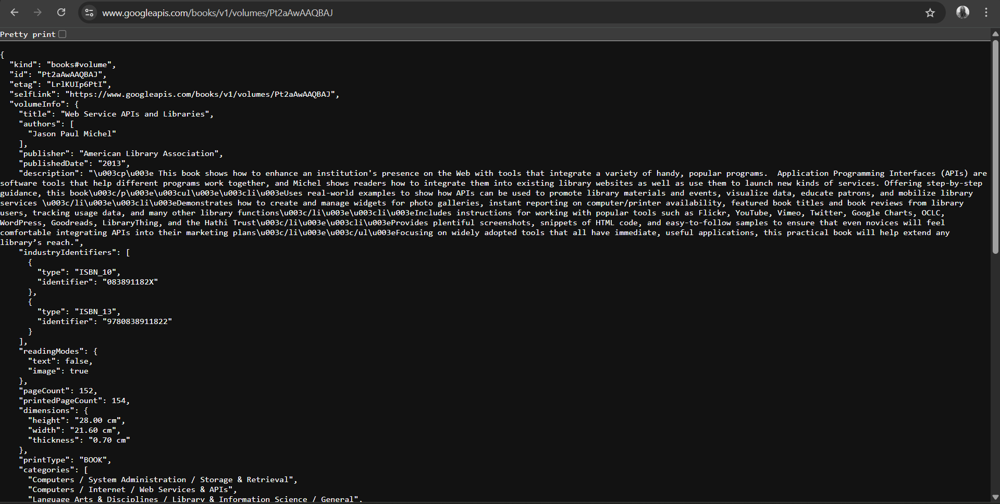

# Praktikum : Asynchronous

Projek Buku

## Praktikum 1

### Soal 2



### Soal 3


- **_substring(0, 450)_** digunakan untuk mengambil 450 karakter pertama dari isi respons server agar tampilannya tidak terlalu panjang.

- **_.catchError((\_) {...})_** digunakan untuk menangani error yang mungkin terjadi saat mengambil data, misalnya jaringan gagal atau server error, dan mencegah aplikasi crash.

## Praktikum 2

### Soal 4


- **Langkah 1 : Menambahkan 3 method async**

```dart
Future<int> returnOneAsync() async {
    await Future.delayed(const Duration(seconds: 3));
    return 1;
  }

  Future<int> returnTwoAsync() async {
    await Future.delayed(const Duration(seconds: 3));
    return 2;
  }

  Future<int> returnThreeAsync() async {
    await Future.delayed(const Duration(seconds: 3));
    return 3;
  }
```

**Maksud dari penambahan 3 method async pada code diatas :**

1. Ketiga method tersebut adalah fungsi _asynchronous_ yang menunggu ( _await_ ) selama 3 detik, lalu mengembalikan angka 1, 2, dan 3 dari urutan/kondisi methodnya.

2. _Future.delayed_ mensimulasikan proses yang memerlukan waktu, seperti memuat data dari internet atau database.

3. Masing-masing fungsi seperti representasi tugas asynchronous yang selesai dalam 3 detik.

- **Langkah 2 : Menambahkan method count()**

```dart
Future count() async {
    int total = 0;
    total = await returnOneAsync();
    total += await returnTwoAsync();
    total += await returnThreeAsync();
    setState(() {
      result = total.toString();
    });
  }
```

**Maksud dari penambahan penambahan method count() pada code diatas :**

1. Fungsi _count()_ menjalankan ketiga fungsi _async_ tadi secara berurutan.

2. Nilai yang dikembalikan oleh masing-masing fungsi dijumlahkan ke dalam variabel total.

   - Setelah 3 detik: total = 1

   - Setelah 6 detik: total = 1 + 2 = 3

   - Setelah 9 detik: total = 1 + 2 + 3 = 6

3. Setelah semuanya selesai, _setState()_ dipanggil untuk memperbarui tampilan aplikasi (UI) dengan nilai total tersebut.

## Praktikum 3

### Soal 5


- **Langkah 2 : Menambahkan Variabel dan Method**

```dart
late Completer completer;

Future getNumber() {
  completer = Completer<int>();
  calculate();
  return completer.future;
}

Future calculate() async {
  await Future.delayed(const Duration(seconds : 5));
  completer.complete(42);
}
```

**Maksud dari penambahan variabel dan method pada code diatas :**

1. Completer adalah objek khusus yang digunakan untuk mengontrol penyelesaian (complete) dari sebuah Future secara manual.

2. Kata kunci late berarti completer akan diinisialisasi nanti, sebelum digunakan — tepatnya di dalam getNumber().

3. Fungsi ini membuat Completer<int> baru.

4. Kemudian menjalankan method calculate() yang akan menyelesaikan (complete) Completer setelah 5 detik.

5. Mengembalikan Future dari completer.future, yang nantinya akan bernilai 42 ketika calculate() selesai.

6. Fungsinya seperti menunggu jawaban dari proses asinkronus yang kita kontrol sendiri.

7. Menunggu selama 5 detik (delay).

8. Setelah selesai, memanggil completer.complete(42); untuk menyelesaikan Future dari getNumber() dan memberikan nilainya 42.
